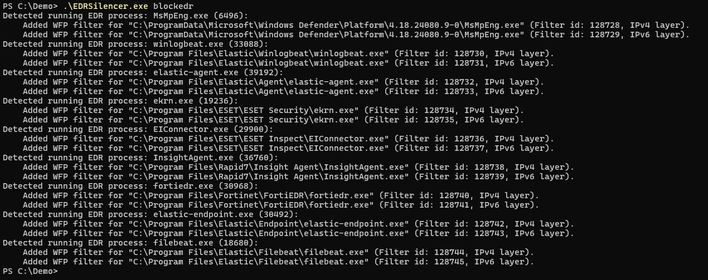
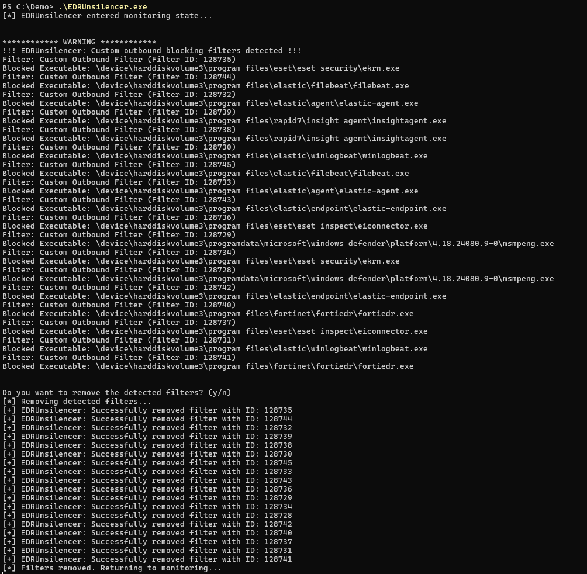

# EDRUnsilencer: Monitoring and Removing WFP Block Rules

### Overview

**EDRUnsilencer** is a proof-of-concept (PoC) tool created in response to tools like **EDRSilencer** and **MDSec Fireblock**. It demonstrates the ability to monitor and remove malicious Windows Filtering Platform (WFP) block rules that aim to block specific executables (such as Microsoft Defender, SentinelOne, etc.) by preventing their outbound IPv4/IPv6 traffic.

While EDRUnsilencer is not intended for use in production environments, it serves as inspiration for security researchers, EDR vendors, and professionals who wish to explore how to detect and remove malicious WFP filtering rules.

### Features

- Monitors for custom WFP block rules that may have been created by tools like EDRSilencer.
- Provides an option to remove detected block rules in real-time.
- Aimed at inspiring further research and development in EDR systems to better handle malicious filtering rules.

### Usage

You can compile the source code into an executable using the following command:

```bash
x86_64-w64-mingw32-gcc EDRUnsilencer.c -o EDRUnsilencer.exe -lFwpuclnt -luser32 -mconsole
```

This will generate the executable `EDRUnsilencer.exe` which can then be run on Windows systems to monitor and remove WFP block rules.

### How It Works

1. **Monitoring**: The tool constantly monitors the Windows Filtering Platform (WFP) for outbound block rules that target specific executables. These rules are often created by malicious tools like EDRSilencer.
  
2. **Removing**: When block rules are detected, EDRUnsilencer prompts the user to either remove them or continue monitoring without action. If chosen, the tool removes the identified malicious WFP block rules.

### Example Workflow

1. Start **EDRUnsilencer**:
   ```bash
   ./EDRUnsilencer.exe
   ```

2. The tool will enter a monitoring state, continuously scanning for WFP block rules. Once a rule is detected, it will display information about the blocked executable.

3. You'll be prompted with an option to remove the detected rules or continue monitoring without removing them.

4. If you choose to remove the rules, the tool will proceed to clear them and return to the monitoring state.

### Screenshots

1. EDRSilencer in Action
In this screenshot, you can see **EDRSilencer** creating block rules for various EDR executables on my test system:
> 

2. EDRUnsilencer in Action
Here, **EDRUnsilencer** is actively monitoring for and removing the rules that were created by EDRSilencer:
> 


### System Requirements

- Windows OS
- Administrative privileges (required to interact with WFP)
- GCC for Windows (e.g., MinGW-w64) or another compatible compiler.

### Compilation Requirements

Make sure you have the following libraries available when compiling:
- **Fwpuclnt** (Windows Filtering Platform API)
- **User32** (for handling user input)

### License

**EDRUnsilencer** is released into the public domain under The Unlicense. This means anyone is free to use, modify, or distribute this software without restriction. We encourage its use for educational and research purposes. A shout out would be appreciated! :)

### Disclaimer

This tool is a proof of concept and is not intended for use in production systems. It aims to inspire and demonstrate a method for defeating tools like EDRSilencer and MDSec's Fireblock. I encourage EDR vendors to explore the concept and develop their own strategies based on it.
